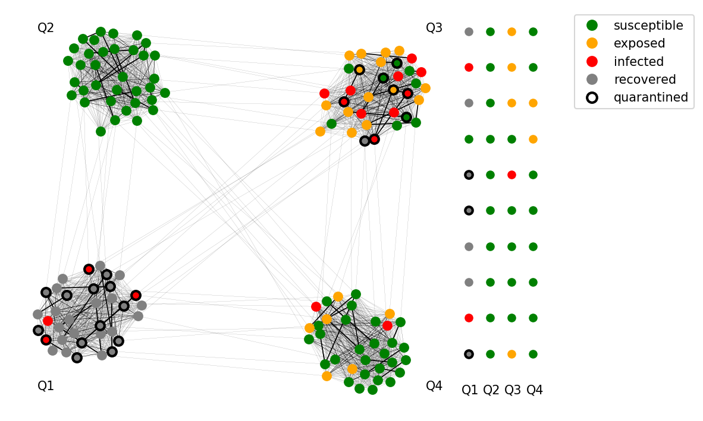

# Agent based simulation of the spread of COVID-19 in nursing homes
**Author: Jana Lasser, Complexity Science Hub Vienna (lasser@csh.ac.at)**

A simple simulation to explore the spread of COVID-19 in nursing homes via agent-based modeling (ABM) of inhabitants and employees of nursing homes. The model follows an SEIRX approach, building on the agent based simulation framework [mesa](https://mesa.readthedocs.io/en/master/) in which agents can be susceptible (S), exposed (E), infected (I), removed (R) or quarantined (X). The model offers the possibility to explore the effectiveness of various testing, tracing and quarantine strategies and implements an empirically measured contact network of nursing home inhabitants.  

 


**This software is under development and intended to respond rapidly to the current situation. Please use ist with caution and bear in mind that there might be bugs**

Reference:  

_Lasser, J. (2020). Agent based simulation of the spread of COVID-19 in nursing homes. DOI: 10.5281/zenodo.4106334_

## Simulation design
### Infections
We simulate two types of agents (inhabitants and employees) that live and work in nursing homes. Inhabitants have an explicitly defined contact network that is defined through their room neighbors, table neighbors at joint meals and inhabitants that live in the same living area of the nursing home. The contact network defines which inhabitants interact with which other inhabitants and different contact venues modulate infection transmission risk (for example infection risk is drastically increased for room mates). We provide one exemplary contact network, specified as a ```networkx``` graph with edge attributes for different interaction venues Employees have no explicitly defined contact network and interact with all inhabitants and all other employees. In every step (day) of the simulation, agents interact according to their interaction rules and can transmit an infection. Depending on their infection state, an agent has one of five states: susceptible (S), exposed (E), infected (I), removed (R) or quarantined (X). In addition, agents can develop symptoms, can be testable and can have a pending test result (tested). Infections are introduced through employees that have a certain probability to become an index case.  

### Containment strategies
Next to the transmission of the infection, the nursing home implements containment measures (quarantine) and a testing and tracing strategy to curb the spread of the virus among its inhabitants and employees. Symptomatic cases are immediately quarantined and tested. Tests take a certain (to be specified) time to return a result. Once a positive test result is returned, all close contacts (K1 contact persons) of the positive agent are immediately quarantined. The definition of "close contact" is also up for specification. By default, room and table mates of inhabitants are defined as "close contact", whereas employees have no specific close contacts. If there is a positive test result, the nursing home can launch a "background screen" of its population, testing all its employees and inhabitants. A background screen is followed by a "follow up screen" with a to-be-specified time-delay (should be close to the exposure duration). Next to population screening that is triggered by positive test results, the nursing home can do "preventive screens" in set intervals. The intervals for these screens can be specified and can be chosen differently for the inhabitants and employees.

### Implementation
* SEIRX model parameters and parameters for the testing strategy are defined in the ```model_SEIRX.py``` file
* There are two types of agents: patients and employees that behave differently and are defined in the ```agent_patient.py``` and ```agent_employee.py``` file respetively.
* ```testing_strategy.py``` implements the testing strategy defined in the model.
* ```viz.py``` provides some custom visualization utility to plot infection timelines and agent states on a network

## Assumptions
The assumptions made by the model to simplify the dynamics of infection spread and estimates of relevant parameters of virus spread are detailed in the following.

### Parameters
* **Exposure time** (latent time): The time from transmission to becoming infectious is approximated to be five days ([Linton et al. 2020](https://www.mdpi.com/2077-0383/9/2/538), [Lauer et al. 2020](https://www.acpjournals.org/doi/full/10.7326/M20-0504)).
* **Infectivity duration**: An infected agent is assumed to be infectious for 10 days after becoming infections ([Walsh et al. 2020](https://doi.org/10.1016/j.jinf.2020.06.067)).
* **Time until symptoms** (incubation time): Humans infected with SARS-CoV2 that develop a clinical course of the disease usually develop symptoms only after they become infectious. We assume the length of the time period between becoming infectious and developing symptoms to be two days ([He et al. 2020](https://www.nature.com/articles/s41591-020-0869-5)).
* **Infectiousness**: We assume that infectiousness stays constantly high in the two days before symptoms onset and decreases monotonically after symptoms onset until it reaches zero 8 days after symptoms onset ([He et al. 2020](https://doi.org/10.1038/s41591-020-0869-5), [Walsh et al. 2020](10.1016/j.jinf.2020.06.067)).
* **Symptom probability**: A large proportion of infections with SARS-CoV2 take a subclinical (i.e. asymptomatic) course. We assume that this is true for 40% of infections [(Nikolai et al. 2020)](https://www.sciencedirect.com/science/article/pii/S1201971220307062#bib0100). Nevertheless, a differentiation between inhabitants and personnell might be warranted, with a lower probability to remain asymptomatic for inhabitants, as evidence is mounting that age correlates negatively with the probability to have an asymptomatic course [(McMichael et al. 2020)](https://www.nejm.org/doi/full/10.1056/NEJMoa2005412)
* **Infectiousness of asymptomatic cases**: We assume that the infectiousness of asymptomatic persons is the same as the infectiousness of symptomatic cases ([Nikolai et al. 2020](https://www.sciencedirect.com/science/article/pii/S1201971220307062#bib0100), [Walsh et al. 2020](https://doi.org/10.1016/j.jinf.2020.06.067)). 
* **Transmission risk**: The simulation defines transmission risks between the two groups of agents and within a group of agents. Furthermore, transmission risk is increased for inhabitants that share a room (by a factor of 7) and for inhabitants that eat on the same table (by a factor of 3). Transmission risks in the model are calibrated such that the basic reproduction number R_0 approaches 2.5 to 3 (the value currently reported for SARS-Cov2 spread in the literature, see [Li et al. 2020](https://doi.org/10.1056/NEJMoa2001316), [Wu et al. 2020](http://www.sciencedirect.com/science/article/pii/S0140673620302609) ) in a system without interventions.
* **Time until testable**: Humans infected with SARS-CoV2 are usually infectious for a short while before the infection can be detected by a test. We assume this time to be two days.

### Interaction and intervention assumptions
* **Time**: We assume that one model simulation step corresponds to one day. Simulation parameters are chosen accordingly.
* **Testing**: We assume that testing happens with an idealised accuracy of 100%. Therefore if a testable person is tested, the test will return a positive result in all cases.
* **Quarantine duration**: We assume that agents that were tested positive are isolated (quarantined) for 14 days, according to [recommendations by the WHO](https://www.who.int/publications/i/item/considerations-for-quarantine-of-individuals-in-the-context-of-containment-for-coronavirus-disease-(covid-19)).
* **Index cases**: We assume that infections in nursing homes are primarily introduced by employees. Therefore only employees can become index cases with a certain (to be specified in the model) probability in every simulation step.
* **Interaction of inhabitants with inhabitants**: We assume that every inhabitant interacts with every other inhabitant that lives in the same living area of the facility every day (simulation step) and has a basic probability to transmit an infection.
* **Interaction of employees with inhabitants**: We assume that every employee interacts with every inhabitant every day and has a basic probability to transmit an infection.
* **Interaction of employees with employees**: We assume that every employee interacts with every other employee every day and has a basic probability to transmit an infection.

## Installation (Linux)
1. Clone the repository:  
```git clone https://github.com/JanaLasser/SEIRX_nursing_homes.git```  
2. Create and activate a virtual environment  
```python3 -m venv .my_venv```  
```source .my_venv/bin/activate```  
3. Update pip  
``` pip install --upgrade pip```  
4. Install dependencies  
```pip install -r requirements.txt```  

## Running the simulation
The following requires the activation of the virtual environment you created during installation  
```source .my_venv/bin/activate```

I provide an exemplary [Jupyter Notebook](https://github.com/JanaLasser/SEIRX_nursing_homes/blob/master/example.ipynb) that illustrates how a simulation model is set up and run, how results are visualised and how data from a model run can be collected.

## Acknowledgements
I would like to thank [Peter Klimek](https://www.csh.ac.at/researcher/peter-klimek/) from Complexity Science Hub Vienna and Thomas Wochele-Thoma from [Caritas Austria](https://www.caritas.at/) for the fruitful discussions that led to the development of this project.

## References
Linton, N. M., Kobayashi, T., Yang, Y., Hayashi, K., Akhmetzhanov, A. R., Jung, S. M., ... & Nishiura, H. (2020). Incubation period and other epidemiological characteristics of 2019 novel coronavirus infections with right truncation: a statistical analysis of publicly available case data. Journal of clinical medicine, 9(2), 538. [DOI: 10.3390/jcm9020538](https://doi.org/10.3390/jcm9020538)  

Lauer, S. A., Grantz, K. H., Bi, Q., Jones, F. K., Zheng, Q., Meredith, H. R., ... & Lessler, J. (2020). The incubation period of coronavirus disease 2019 (COVID-19) from publicly reported confirmed cases: estimation and application. Annals of internal medicine, 172(9), 577-582. [DOI: 10.7326/M20-0504](https://doi.org/10.7326/M20-0504)  

Walsh, K. A., Jordan, K., Clyne, B., Rohde, D., Drummond, L., Byrne, P., ... & O'Neill, M. (2020). SARS-CoV-2 detection, viral load and infectivity over the course of an infection: SARS-CoV-2 detection, viral load and infectivity. Journal of Infection. [DOI: 10.1016/j.jinf.2020.06.067](10.1016/j.jinf.2020.06.067)  

He, X., Lau, E. H., Wu, P., Deng, X., Wang, J., Hao, X., ... & Mo, X. (2020). Temporal dynamics in viral shedding and transmissibility of COVID-19. Nature medicine, 26(5), 672-675. [DOI: 10.1038/s41591-020-0869-5](https://doi.org/10.1038/s41591-020-0869-5)  

Nikolai, L. A., Meyer, C. G., Kremsner, P. G., & Velavan, T. P. (2020). Asymptomatic SARS Coronavirus 2 infection: Invisible yet invincible. International Journal of Infectious Diseases. [DOI: 10.1016/j.ijid.2020.08.076](https://doi.org/10.1016/j.ijid.2020.08.076)  

McMichael, T. M., Currie, D. W., Clark, S., Pogosjans, S., Kay, M., Schwartz, N. G., ... & Ferro, J. (2020). Epidemiology of Covid-19 in a long-term care facility in King County, Washington. New England Journal of Medicine, 382(21), 2005-2011. [DOI: 10.1056/NEJMoa2005412](https://doi.org/10.1056/NEJMoa2005412)  

Li, Q., Guan, X., Wu, P., Wang, X., Zhou, L., Tong, Y., ... & Xing, X. (2020). Early transmission dynamics in Wuhan, China, of novel coronavirus–infected pneumonia. New England Journal of Medicine. [DOI: 10.1056/NEJMoa2001316](https://doi.org/10.1056/NEJMoa2001316)  

Wu, J. T., Leung, K., & Leung, G. M. (2020). Nowcasting and forecasting the potential domestic and international spread of the 2019-nCoV outbreak originating in Wuhan, China: a modelling study. The Lancet, 395(10225), 689-697. [DOI: 10.1016/S0140-6736(20)30260-9](https://doi.org/10.1016/S0140-6736(20)30260-9)  
